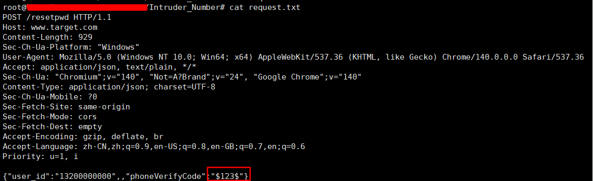
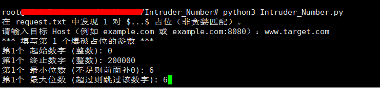

```txt
./Intruder_Number
	├── Intruder_Number.py 运行脚本
	├── request.txt 输入请求文本
	└── result.xlsx 输出结果
```

# Python 依赖

```shell
pip install requests openpyxl
```

# 使用

与 Burpsuite 使用一致，在 request.txt 中以 $ 作为位置识别符，最多可识别两对 $ 符号作为爆破位置，当爆破位置超过 2 个时，会退出程序并提示

```shell
python3 Intruder_Number.py
```




