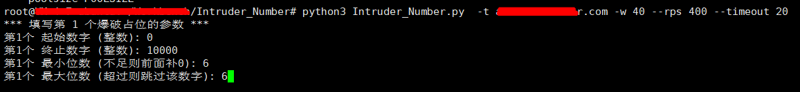

```txt
./Intruder_Number
	├── Intruder_Number.py 运行脚本
	├── request.txt 输入请求文本
	└── result.xlsx 输出结果
```

# Intruder_Number.py

## Python 依赖

```shell
pip install requests openpyxl
```

## 使用

 **默认只走 HTTP/1.1** ，与 Burpsuite 使用一致，在 request.txt 中以 $ 作为位置识别符，最多可识别两对 $ 符号作为爆破位置，当爆破位置超过 2 个时，会退出程序并提示

```shell
usage: Intruder_Number.py [-h] [--request-file REQUEST_FILE] --target TARGET [--workers WORKERS] [--rps RPS] [--timeout TIMEOUT] [--output OUTPUT] [--verify] [--max-retries MAX_RETRIES] [--poolsize POOLSIZE]
```

并发爆破脚本（支持 --workers 和 --rps）

```shell
options:
  -h, --help            show this help message and exit
  --request-file REQUEST_FILE, -r REQUEST_FILE
  --target TARGET, -t TARGET 目标 Host，例如 example.com 或 example.com:8080
  --workers WORKERS, -w WORKERS
  --rps RPS             全局 requests per second（0 表示不限制）
  --timeout TIMEOUT
  --output OUTPUT, -o OUTPUT
  --verify              验证 TLS 证书（默认不验证）
  --max-retries MAX_RETRIES
  --poolsize POOLSIZE
```

例：

```shell
python3 Intruder_Number.py  -t authex.hihonor.com -w 40 --rps 400 --timeout 20
```



**最小参数运行：**

```shell
python3 Intruder_Number.py --target example.com
```

